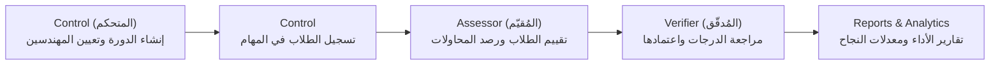

# 🎓 Elsewedy Assessment & Competency Management System
> **Enterprise Competency Assessment & Quality Verification Platform for Technical Academies**  
> Developed for **Elsewedy Electrometer / Elsewedy Technical Academy (STA)**

---

## 📌 نظرة عامة على المشروع (Project Overview)

منظومة تقييم واعتماد الكفاءات والمهارات الفنية لطلاب الأكاديمية، مبنية وفق أحدث معايير تجربة المستخدم وتعتمد دورة عمل ثلاثية الأدوار (**Control**, **Assessor**, **Verifier**) لضمان النزاهة ودقة النتائج وسرعة استخراج التقارير والتحليلات.

---

## 🛠️ البنية التقنية (Tech Stack)

### **Frontend**
- **Framework**: Next.js 16 (App Router with Turbopack)
- **Styling**: Tailwind CSS, Elsewedy Brand Identity (`#c8102e`)
- **Components**: Radix UI Primitives, Lucide Icons
- **State & Theme**: React Hooks, Next Themes (Dark / Light)

### **Backend**
- **Framework**: ASP.NET Core Web API (.NET 10)
- **ORM**: Entity Framework Core 10
- **Architecture**: Repository Pattern, DTOs, Scoped Dependency Injection
- **Documentation**: Swagger / OpenAPI

### **Database**
- **Engine**: Microsoft SQL Server
- **Hosting**: Deployed Cloud Database (`db56344.public.databaseasp.net`)

---

## 👥 حسابات الدخول المتاحة للتجربة (Pre-seeded Accounts)

جميع الحسابات التالية نشطة ومسجلة مسبقاً في قاعدة البيانات السحابية:

| الدور (Role) | البريد الإلكتروني (Email) | كلمة المرور (Password) | الصلاحيات ومسار الواجهة |
| :--- | :--- | :--- | :--- |
| **Control (المتحكم)** | `controler@gmail.com` | `123456` | إدارة الدورات، تعيين المهندسين، تسجيل الطلاب، التقارير (`/controller/*`) |
| **Assessor (المُقيّم)** | `eng2@gmail.com` | `123456` | رصد درجات الطلاب، تقييم المهام والمحاولات A-D (`/assessor/*`) |
| **Verifier (المُدقّق)** | `eng@gmail.com` | `123456` | مراجعة واعتماد التقييمات وتدقيق النتائج المرفوعة (`/verifier/*`) |
| **Student (طالب)** | `ibrahim.adel1@school.com` | `123456` | حساب طالب مسجل بالدورة الحالية |
| **Student (طالب)** | `ahmed.sayed2@school.com` | `123456` | حساب طالب مسجل بالدورة الحالية |

---

## 🚀 التشغيل السريع (Getting Started)

### 1. تشغيل الـ Backend (.NET Web API)
```bash
# الانتقال لمسار مشروع الـ API والتشغيل
dotnet run --project AssessmentWebApi/AssessmentWebApi/AssessmentWebApi.csproj --launch-profile http
```
- يعمل السيرفر على: **`http://localhost:5247`**
- متصل مباشرة بقاعدة البيانات السحابية المرفوعة (`db56344`).

### 2. تشغيل الـ Frontend (Next.js)
```bash
# تثبيت الاعتماديات (إذا لم تكن مثبتة)
npm install

# تشغيل سيرفر التطوير
npm run dev
```
- التطبيق متاح على: **`http://localhost:3000`**
- صفحة تسجيل الدخول: **`http://localhost:3000/login`**

---

## 🔄 مسار العمل ودورة التقييم (Assessment Workflow)



1. **المتحكم (Control)**: يُنشئ الدورة التقييمية (`CourseRound`)، ويُسند المقيّمين والمدققين للمجموعات، ثم يُسجل الطلاب في المهام.
2. **المقيّم (Assessor)**: يستعرض قائمة الطلاب المسندين إليه، ويقوم برصد الدرجات والملاحظات وفق محاولات متتالية (A, B, C, D).
3. **المدقق (Verifier)**: يراجع سجل التقييمات والملاحظات للتأكد من التزام المعايير، مع إمكانية إضافة ملاحظات التدقيق.
4. **التقارير والإحصائيات**: لوحات تحكم تفاعلية توضح نسب الاجتياز، وتوزيع الدرجات ومؤشرات الأداء اللحظية.

---

## 📂 هيكل المشروع (Project Structure)

```text
sewedy-assessment-system/
├── app/                           # Next.js App Router (الصفحات والمسارات)
│   ├── assessor/                  # واجهات المُقيّم (قوائم الطلاب، نموذج التقييم)
│   ├── controller/                # واجهات المتحكم (إدارة الدورات، التعيينات)
│   ├── verifier/                  # واجهات المُدقّق (المراجعة والتدقيق)
│   └── login/                     # بوابة تسجيل الدخول الموحدة
├── components/                    # مكونات الواجهة (UI & Design System)
│   ├── assess/                    # نماذج التقييم التفاعلية
│   ├── layout/                    # شريط التنقل وتوجيه الأدوار (RoleRouter)
│   └── ui/                        # مكونات التصميم (Elsewedy Style)
├── hooks/                         # React Custom Hooks للتعامل مع الـ API
├── lib/                           # مكتبات الاتصال والتوثيق والـ Types
│   ├── api-client.ts              # عميل الـ API المركزي
│   ├── api-config.ts              # إعدادات الروابط
│   └── auth-context.tsx           # إدارة جلسة المستخدم والأدوار
├── AssessmentWebApi/              # ASP.NET Core Backend Solution
│   └── AssessmentWebApi/
│       ├── Controllers/           # وحدات التحكم (Auth, Students, Courses...)
│       ├── Data/                  # سياق قاعدة البيانات (AppDbContext)
│       ├── Dto_s/                 # كائنات نقل البيانات (DTOs)
│       └── Repository/            # نمط المستودعات (Repository Pattern)
└── README.md                      # توثيق المشروع
```

---

## 🔒 الأمان وحماية البيانات (Security & Standards)
- تشفير كلمات المرور باستخدام **SHA-256** مع التحقق من الهوية وصلاحيات الدور.
- تصفية الصلاحيات على مستوى الـ Routing في الـ Frontend وحماية مسارات الـ API في الـ Backend.
- تسجيل العمليات في سجل التدقيق الموحد (`AuditLog`).
